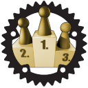

# Software Challenge Rust SDK

[Software Challenge](https://www.software-challenge.de) client framework written in Rust.

This repository contains both the game-agnostic `client-base` module and game-specific plugins, which can be used to create a custom client.
